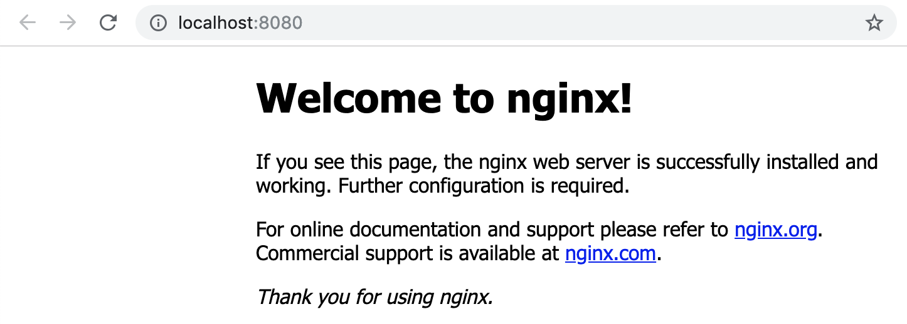

# Lab 2 - Pods

In this lab we will run our first, very basic, application on Kubernetes.  We
will basically run a single pod as our application.

## Task 1: Starting your first pod

To run your first pod (the official nginx container image), run the following
command:

```
kubectl run --restart=Never --image=nginx  nginx

---

pod "nginx" created
```

The above command will create a single pod that is based on the official nginx
container image.  Run the following command to verify that the pod has been
created and is in the running state (if the pod is not yet in the running state
wait a couple of seconds and try to run the command again):

```
kubectl get pods

---

NAME      READY     STATUS    RESTARTS   AGE
nginx     1/1       Running   0          22s
```

As we have not yet configured any services and/or ingresses we will use a litte
"hack" to access our pod we just created.

Run the following command to forward the port of the pod (in our case port 80)
running in our Kubernetes cluster to a port on your laptop (in this case port
8080).

```
kubectl port-forward pod/nginx 8080:80
```

> NOTE: your prompt will be locked by the port-forward process

Now go to your browser and surf to http://localhost:8080, you should be greeted
with the default nginx welcome page:



If that works you can close the port-foward connection by pressing `CTRL+c`.

## Task 3: Connecting to your pod

To connect to your pod, you can use the following command (notice how it
resembles the `podman container exec` command in options and functionality):

```
kubectl exec -ti nginx -- bash

---

root@nginx:/#
```

Notice how the prompt changes.  `exec`-ing into a pod is very powerful for
troubleshooting, but keep in mind that by default pods/containers are immutable
so remember to not make any changes inside the pods/container.

To exit run the `exit` command.

```
exit
```

## Task 4: Pod logs

Again similar to when working with Podman containers, Kubernetes has a built-in
feature that exposes all stdout/stderr output into logs.  To access those logs
issue the following command:

```
kubectl logs nginx

---

127.0.0.1 - - [11/Mar/2019:11:40:47 +0000] "GET / HTTP/1.1" 200 612 "-" "curl/7.52.1" "-"
127.0.0.1 - - [11/Mar/2019:11:40:48 +0000] "GET / HTTP/1.1" 200 612 "-" "curl/7.52.1" "-"
127.0.0.1 - - [11/Mar/2019:11:40:49 +0000] "GET / HTTP/1.1" 200 612 "-" "curl/7.52.1" "-"
127.0.0.1 - - [11/Mar/2019:11:40:50 +0000] "GET / HTTP/1.1" 200 612 "-" "curl/7.52.1" "-"
```

> NOTE: if your logs are empty, repeat Task 2 where you `kubectl port-forward` 
> the container port and hit reload the page a couple more times in your 
> browser

A very handy option of `kubectl logs` is that you can follow them using the `-f`
option, this is extremely useful when troubleshooting:

```
kubectl logs nginx -f
```

Hit `CTRL+c` to exit the logs.

## Task 5: Getting pod details

Like with most objects in Kubernetes you can use the `kubectl describe` command 
to get more information about a specific pod, for example:

```
kubectl describe pods nginx

---

Name:             nginx
Namespace:        alpha
Priority:         0
Service Account:  default
Node:             kbck8s.timmeje.gluo.io/172.31.12.132
Start Time:       Mon, 07 Nov 2022 14:10:45 +0100
Labels:           run=nginx
Annotations:      cni.projectcalico.org/containerID: bfc534439df5871d08385fe03c861ad892438b129859e9a906e13ccf50520ecb
                  cni.projectcalico.org/podIP: 10.1.70.4/32
                  cni.projectcalico.org/podIPs: 10.1.70.4/32
Status:           Running
IP:               10.1.70.4
IPs:
  IP:  10.1.70.4
Containers:
  nginx:
    Container ID:   containerd://ba9cad8e9cbc43105d57fc748b3209b1f879b054369d02e153fc31928a0c931c
    Image:          nginx
    Image ID:       docker.io/library/nginx@sha256:943c25b4b66b332184d5ba6bb18234273551593016c0e0ae906bab111548239f
    Port:           <none>
    Host Port:      <none>
    State:          Running
      Started:      Mon, 07 Nov 2022 14:10:47 +0100
    Ready:          True
    Restart Count:  0
    Environment:    <none>
    Mounts:
      /var/run/secrets/kubernetes.io/serviceaccount from kube-api-access-qwz2n (ro)
Conditions:
  Type              Status
  Initialized       True 
  Ready             True 
  ContainersReady   True 
  PodScheduled      True 
Volumes:
  kube-api-access-qwz2n:
    Type:                    Projected (a volume that contains injected data from multiple sources)
    TokenExpirationSeconds:  3607
    ConfigMapName:           kube-root-ca.crt
    ConfigMapOptional:       <nil>
    DownwardAPI:             true
QoS Class:                   BestEffort
Node-Selectors:              <none>
Tolerations:                 node.kubernetes.io/not-ready:NoExecute op=Exists for 300s
                             node.kubernetes.io/unreachable:NoExecute op=Exists for 300s
Events:
  Type    Reason     Age   From               Message
  ----    ------     ----  ----               -------
  Normal  Scheduled  4s    default-scheduler  Successfully assigned alpha/nginx to kbck8s.timmeje.gluo.io
  Normal  Pulling    5s    kubelet            Pulling image "nginx"
  Normal  Pulled     4s    kubelet            Successfully pulled image "nginx" in 1.115484667s
  Normal  Created    4s    kubelet            Created container nginx
  Normal  Started    3s    kubelet            Started container nginx
```

## Task 6: Cleaning up

Clean up the pod for this lab:

```
kubectl delete pod nginx

---

pod "nginx" deleted
```
