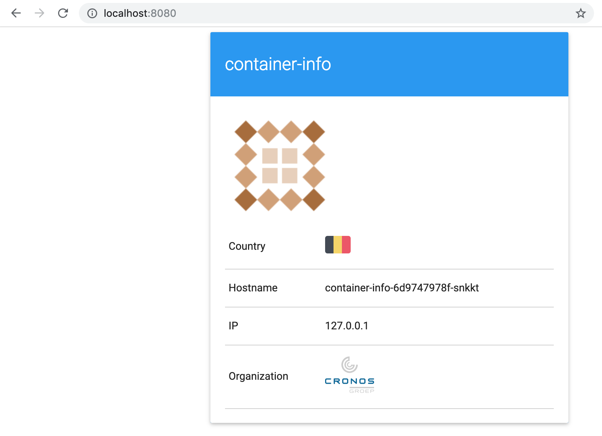

# Lab 04 - Deployments

Deploying pods is not something you normally do when working with Kubernetes,
instead of interacting with pods directly you would use a higher lever
construct.  Deployments are such a higher level construct, they are usually the
way you would describe your applications.

## Task 1: Creating a deployment

A very basic deployment looks like this:

```
apiVersion: apps/v1
kind: Deployment
metadata:
  name: container-info
  labels:
    app: container-info
spec:
  replicas: 1
  selector:
    matchLabels:
      app: container-info
  template:
    metadata:
      labels:
        app: container-info
    spec:
      containers:
      - name: container-info
        image: gluobe/container-info:blue
        ports:
        - containerPort: 80
```

Copy the above into a file `lab-04-deployment.yml` and `kubectl apply` it:

```
kubectl apply -f lab-04-deployment.yml

---

deployment.apps/container-info created
```

Use `kubectl port-forward` to see the deployed application in your local
browser (NOTE: as we are forwarding a deployment we are using `deployment/*` 
instead of `pod/*` like we used in a previous lab):

```
kubectl port-forward deployment/container-info 8080:80

---

Forwarding from 127.0.0.1:8080 -> 80
Forwarding from [::1]:8080 -> 80
```

Check out the page: http://localhost:8080



Kill the `kubectl port-forward` process by pressing `CTRL+c`.

## Task 2: Scaling a deployment

Because we are using a deployment we can very easily scale our application from
a Kubernetes point of view (you of course need to ensure that your application
is stateless so it can properly scale).

Scaling your running application is as simple as:

```
kubectl scale deployment container-info --replicas=2

---

deployment.extensions "container-info" scaled
```

When you do a `kubectl get pods` quickly enough you will see that 
there is an additional container-info pods being created (if you are not fast 
enough you will see them in the `Running` state already).

```
kubectl get pods

---

NAME                              READY   STATUS    RESTARTS   AGE
container-info-6d9747978f-5n6z9   1/1     Running   0          26m
container-info-6d9747978f-ndl6n   1/1     Running   0          4s
```

Scaling down to 1 can be done by re-applying the original YAML:

```
kubectl apply -f lab-04-deployment.yml
```

When you do a `kubectl get pods` you will see one of the replicas is being terminated:

```
kubectl get pods

---

NAME                              READY   STATUS        RESTARTS   AGE
container-info-6d9747978f-5n6z9   1/1     Running       0          27m
container-info-6d9747978f-ndl6n   0/1     Terminating   0          85s
```

> NOTE: similarly, scaling up can also be done by editing the "replica" field in 
> the YAML

## Task 3: Changing the image of a deployment

Updating the image (tag) of a deployment is just as easy as scaling a deployment
and it also can be done using the CLI or by editing the YAML.

```
kubectl set image deployment container-info container-info=gluobe/container-info:green
```

Or simply edit the YAML and `kubectl apply` it again:

```
apiVersion: apps/v1
kind: Deployment
metadata:
  name: container-info
  labels:
    app: container-info
spec:
  replicas: 1
  selector:
    matchLabels:
      app: container-info
  template:
    metadata:
      labels:
        app: container-info
    spec:
      containers:
      - name: container-info
        image: gluobe/container-info:green
        ports:
        - containerPort: 80
```

Open the application again using port forwarding, the box should be green now.

## Task 4: Cleaning up

Ensure that your deployments are cleaned up, either by deleting them directly, or by deleting them using their YAML resource file.